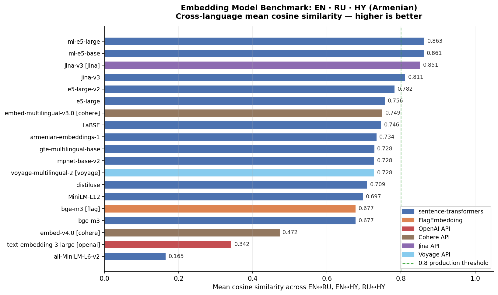
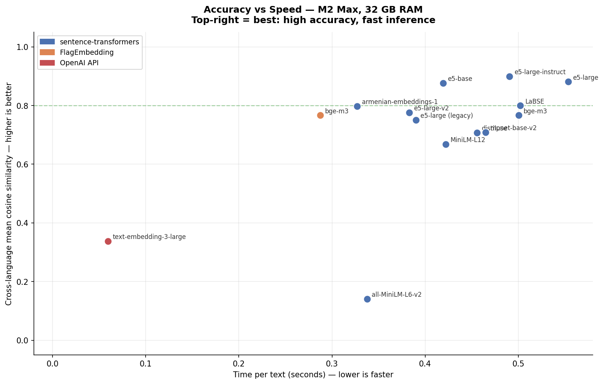
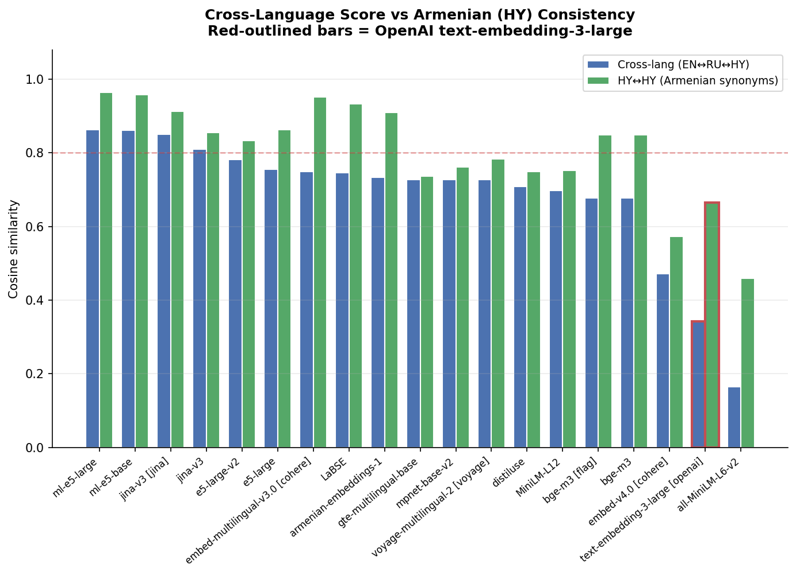
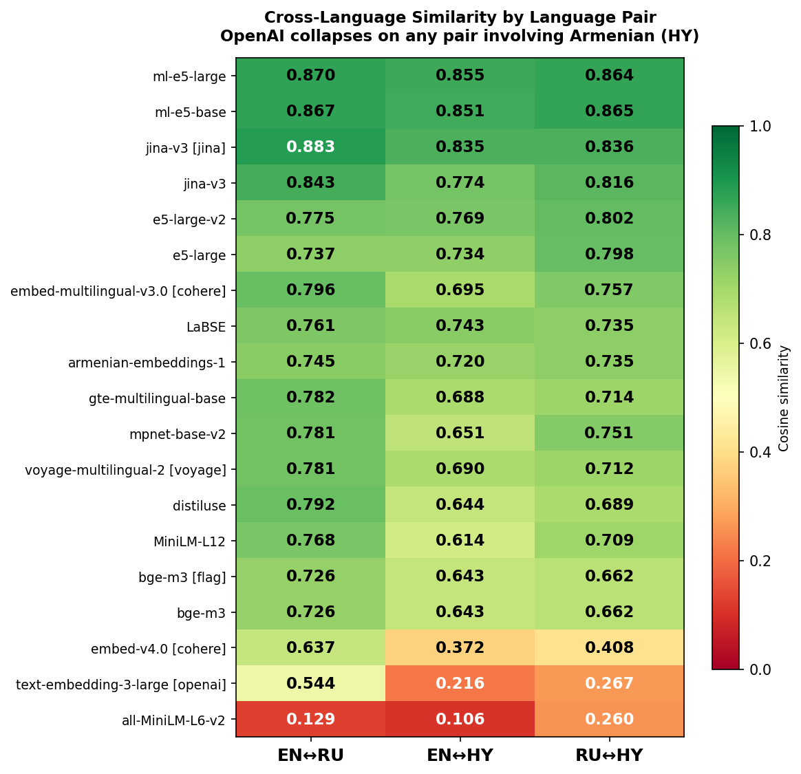
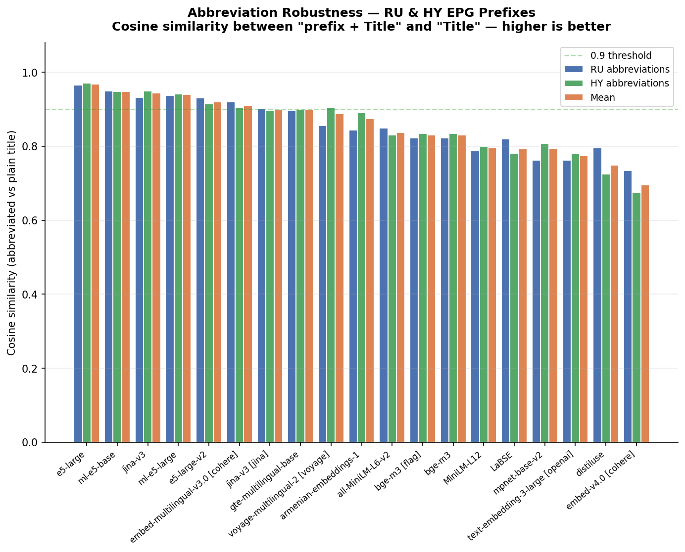
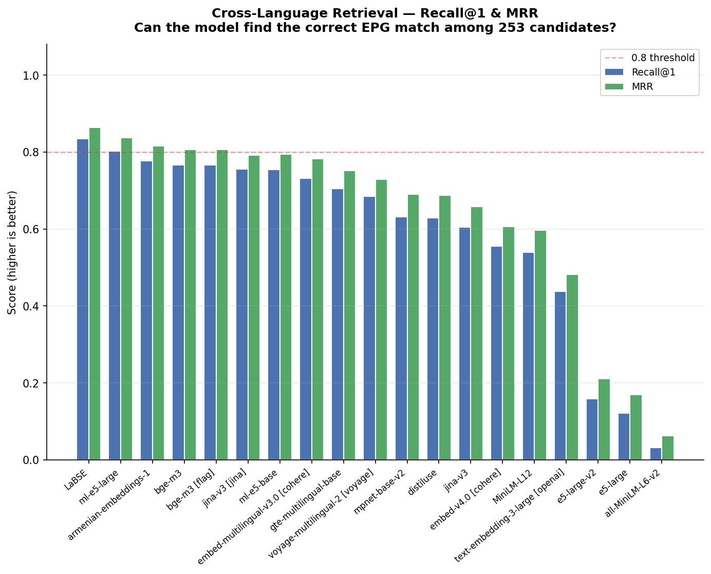
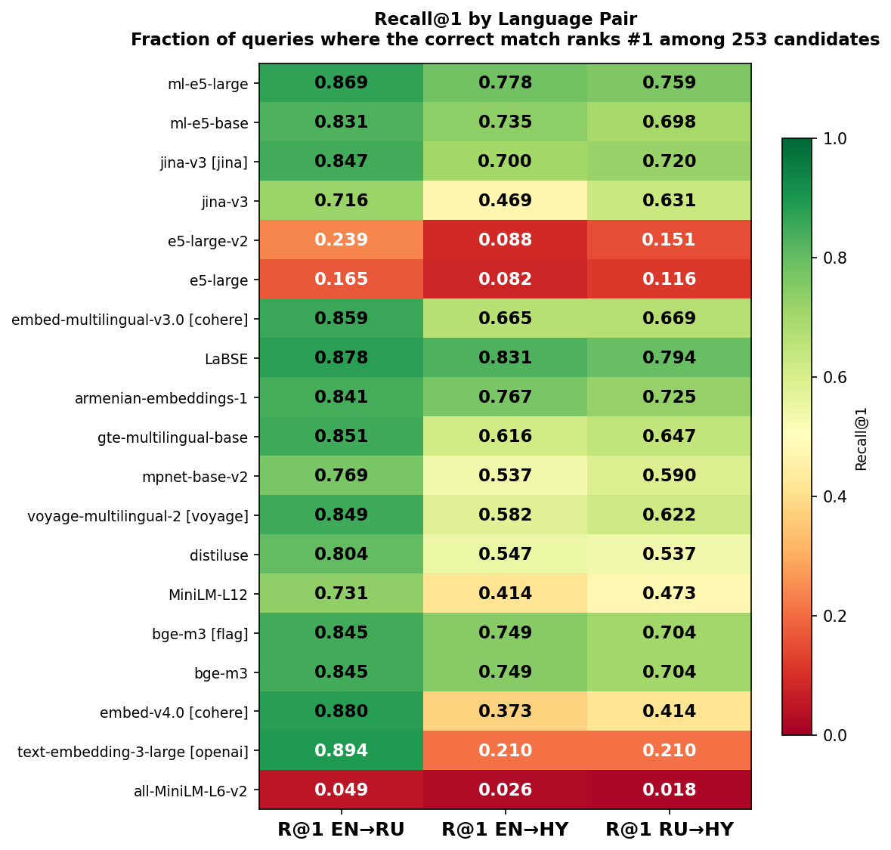

# Multilingual Embedding Benchmark: EN · RU · HY

> Evaluating sentence embedding models for cross-lingual TV program guide matching across **English**, **Russian**, and **Armenian** — a production RecSys problem with a low-resource language twist.

`hy` = Armenian (`հայ.`). This matters because Armenian is a genuinely low-resource language that most commercial models handle poorly.

---

## TL;DR

| Metric | Winner | Score |
|--------|--------|:-----:|
| **Alignment** (cross-lang cosine) | `intfloat/multilingual-e5-large` | **0.863** |
| **Retrieval** (MRR) | `sentence-transformers/LaBSE` | **0.864** |

These are **different models** — alignment (mean cosine similarity) and retrieval (find the correct translation among 245 candidates) do not guarantee each other: `e5-large-v2` is #5 by alignment but #17 by retrieval; `LaBSE` is #8 → #1. See [Key Finding #1](#1-alignment--retrieval-two-different-stories).

**Surprise:** OpenAI `text-embedding-3-large` scores only **0.34** alignment — below all dedicated multilingual models — yet achieves the best EN↔RU R@1 (0.894). Armenian is where it collapses.

**Note:** Instruct variants (e.g. `multilingual-e5-large-instruct`) are excluded — they are designed for asymmetric retrieval and produce misleading results in a symmetric alignment benchmark. See [Limitations](#why-instruct-models-are-excluded).

---

## Background

Built while developing a content recommendation system for an IPTV/OTT operator whose platform serves TV program guides (EPG) in three languages: English, Russian, and Armenian.

### Why these three languages?

Armenian IPTV/OTT EPG feeds use three languages simultaneously: **Armenian** (HY), **Russian** (RU), and **English** (EN). Armenian is the national language. Russian is widely spoken and dominates post-Soviet broadcast metadata. English is the lingua franca of international content. All three coexist in the same EPG feed, making trilingual matching a hard practical requirement rather than an academic exercise.

A 14-day snapshot of a production Armenian EPG feed (239 channels, 35,170 entries, 2025-09-18 to 2025-10-02) shows the language mix:

| Language | Entries | Share |
|----------|--------:|------:|
| Russian only | 18,876 | 53.7% |
| Armenian only | 10,519 | 29.9% |
| English only | 4,236 | 12.0% |
| Mixed (two languages) | 1,519 | 4.3% |

No single entry contained all three languages — each entry has one title written in one or at most two languages, so a RecSys must align them purely through embedding similarity.

Every IPTV operator ingests EPG data from multiple sources. The same program appears on different channels with different entry IDs, different titles, different transliterations, and in different languages. To aggregate a user's watch history across channels — and to power recommendations from it — the system must match these entries together. A RecSys that can't do cross-lingual matching produces poor recommendations for non-English content.

Armenian (`hy`) is particularly challenging:
- Non-Latin, non-Cyrillic script (unique Armenian alphabet: Հ, Ա, Յ, Ե, ...)
- Low-resource language: underrepresented in most embedding model training data
- Domain-specific abbreviations
- Mix of Armenian, Russian and English in EPG titles

### Domain-specific abbreviations

To quantify how prevalent this issue is, an analysis of a 14-day snapshot of a production EPG feed (unmapped raw titles, 2025-09-18 to 2025-10-02) was performed. Out of 11,298 Armenian program titles broadcasted, **29.2%** (3,297 titles) contained at least one domain-specific abbreviation. The most common were:

1. `Հ/Ն` (Հեռուստանովել / Herustanoevel - Telenovela/Soap Opera) — 1,971 occurrences
2. `Հ/Ս` (Հեռուստասերիալ / Herustaserial - TV Series) — 598 occurrences
3. `Գ/Ֆ` (Գեղարվեստական ֆիլմ / Gegharvestakan film - Feature Film) — 112 occurrences
4. `Հ/Շ` (Հեռուստաշոու / Herustashou - TV Show) — 88 occurrences
5. `Մ/Ս` (Մուլտսերիալ / Multserial - Animated Series) — 84 occurrences

This proves that failing to embed abbreviations correctly isn't an edge case; it actively degrades search and recommendation quality for a massive portion of daily linear TV content.

Other common abbreviations include:

  Feature Film
   * `ֆ/ֆ` (ֆիլմ / film) - Less formal, but sometimes used.

  Animations / Cartoons
   * `Մ/Ֆ` (Մուլտիպլիկացիոն ֆիլմ or Մուլտֆիլմ / Multiplikatsion film or Multfilm) - Standard for animated movies.

  Documentary
   * `Փ/Ֆ` (Փաստավավերագրական ֆիլմ / Phastavaveragrakan film) - Standard.
   * `Վ/Ֆ` (Վավերագրական ֆիլմ / Vaveragrakan film) - Standard (often used interchangeably with Փ/Ֆ).

  Show/Entertainment
   * `Ժ/Ծ` (Ժամանցային ծրագիր / Zhamantsayin tsragir) - Standard for entertainment programs.
   * `Թ/Շ` (Թոք շոու / Tok shou) - Standard for talk shows.

  News
   * `Լ/Ծ` (Լրատվական ծրագիր / Lratvakan tsragir) - Standard for news programs/broadcasts.

  Live Broadcasts
   * `Ու/Ե` (Ուղիղ եթեր / Ughigh yeter) — Live Broadcast / Live Air (Very common for news, sports, and events).
   * `Ու/Հ` (Ուղիղ հեռարձակում / Ughigh herardzakum) — Live Broadcast (Alternative to Ու/Ե).

  Specific Film Genres
   * `Կ/Ֆ` (Կարճամետրաժ ֆիլմ / Karchametrazh film) — Short Film.
   * `Պ/Ֆ` (Պատմական ֆիլմ / Patmakan film) — Historical Film.
   * `Ուս/Ֆ` (Ուսումնական ֆիլմ / Usumnakan film) — Educational Film.

  Specific Programs & Shows
   * `Մ/Հ` or `Մ/Ծ` (Մանկական հաղորդում / Mankakan haghordum or tsragir) — Children's Program.
   * `Գ/Հ` or `Գ/Ծ` (Գիտահանրամատչելի հաղորդում / Gitahanramatcheli haghordum) — Scientific / Educational Program.
   * `Ե/Ծ` (Երաժշտական ծրագիր / Yerazhshtakan tsragir) — Musical Program / Concert.
   * `Ս/Հ` (Սպորտային հաղորդում / Sportayin haghordum) — Sports Program.

This benchmark measures how well each model handles **semantic alignment** of the same program title across all three languages.

---

## Evaluation Setup

### Test Dataset

245 trilingual title triplets: 7 hand-crafted TV EPG entries covering news, sports, entertainment, and movies, plus 238 real Armenian titles (movies, animated films, TV series) from [TMDB](https://www.themoviedb.org/) (see [DATASET.md](DATASET.md)).

Hand-crafted EPG triplets:

| ID | English | Russian | Armenian (հայ.) |
|----|---------|---------|-----------------|
| `evening_news` | Evening News | Вечерние новости | Երեկոյան լուրեր |
| `morning_show` | Morning Show | Утреннее шоу | Առավոտյան շոու |
| `documentary_premiere` | Documentary Premiere | Премьера документального фильма | Վավերագրական ֆիլմի պրեմիերա |
| `live_football` | Live Football | Прямая трансляция футбола | Ֆուտբոլի ուղիղ հեռարձակում |
| `cooking_competition` | Cooking Competition | Кулинарное состязание | Խոհարարական մրցույթ |
| `movie_road_home` | Feature Film: The Road Home | к/ф Дорога домой | ֆ/ֆ Տուն վերադարձ |
| `movie_secret_ararat` | Feature Film: Secret of Ararat | к/ф Тайна Арарата | ֆ/ֆ Արարատի գաղտնիքը |

The `movie_*` entries include domain-specific abbreviations (`к/ф` in Russian, `ֆ/ֆ` in Armenian for "Feature Film") that many models have never seen during training — a practical pain point in real EPG pipelines.

### Armenian Synonym Test

4 intra-Armenian synonym pairs to test `HY↔HY` consistency — same concept, two common phrasings:

| ID | Variant A | Variant B |
|----|-----------|-----------|
| `hy_news_bulletin` | Լուրերի թողարկում | Նորությունների թողարկում |
| `hy_live_broadcast` | Ուղիղ հեռարձակում | Ուղիղ եթեր |
| `hy_sports_wrap` | Մարզական ամփոփում | Սպորտային ամփոփագիր |
| `hy_family_movie` | Ընտանեկան ֆիլմ | Ընտանիքի համար նախատեսված ֆիլմ |

### Metrics

**Cross-lingual alignment** — mean cosine similarity across all three cross-lingual pairs (EN↔RU, EN↔HY, RU↔HY). Score range: `1.0` = identical embeddings, `0.0` = no relationship. Why mean and not min? Min hides cases where a model is good on two pairs and poor on one. Mean is more robust to outliers in a specific pair, and per-pair breakdowns are provided in the results table.

**Abbreviation robustness** — mean cos(embed(title), embed(prefix + title)) across 783 duplets (separately for RU and HY). A perfect model scores 1.0: adding `к/ф` or `м/ф` before a title should not shift the embedding.

**HY↔HY consistency** — mean cosine across 4 Armenian synonym pairs (see [Armenian Synonym Test](#armenian-synonym-test) above). Tests whether the model recognizes semantically identical phrases in a low-resource language. N=4 is too small for statistically significant conclusions — this metric is illustrative.

**Recall@1 (R@1)** — for each title in language A, find the nearest neighbor by cosine among all 245 titles in language B. If the nearest is the correct translation, it's a hit. Search runs in both directions (A→B and B→A), R@1 = mean of both directions. Final R@1 = mean across three pairs (EN↔RU, EN↔HY, RU↔HY).

**MRR (Mean Reciprocal Rank)** — like R@1 but accounts for the position of the correct answer: rank 1 → 1.0, rank 2 → 0.5, rank 3 → 0.33, etc. Mean across three pairs.

Cross-lang mean measures **alignment** (how close are correct pairs). R@1 and MRR measure **discrimination** (can the model distinguish the correct pair from 244 incorrect ones). A production system needs both properties.

### Hardware

MacBook M2 Max, 32 GB RAM — local models run via CPU/Metal; paid models (OpenAI, Cohere, Jina, Voyage) use remote APIs.

---

## Results

| # | Backend | Model | Year | Paid | Cross-lang | EN↔RU | EN↔HY | RU↔HY | HY↔HY | R@1 | MRR | Abbrev | s/text |
|---|---------|-------|:----:|:----:|:----------:|:-----:|:-----:|:-----:|:-----:|:---:|:---:|:------:|:------:|
| 1 | st | `intfloat/multilingual-e5-large` | 2023 | | **0.863** | 0.870 | **0.855** | 0.864 | **0.964** | 0.802 | 0.837 | 0.940 | 0.020 |
| 2 | st | `intfloat/multilingual-e5-base` | 2023 | | 0.861 | 0.867 | 0.851 | **0.865** | 0.958 | 0.754 | 0.794 | **0.948** | 0.014 |
| 3 | jina | `jina-embeddings-v3` | 2024 | $$ | 0.851 | **0.883** | 0.835 | 0.836 | 0.913 | 0.756 | 0.791 | 0.899 | 0.009 |
| 4 | st | `jinaai/jina-embeddings-v3` | 2024 | | 0.811 | 0.843 | 0.774 | 0.816 | 0.855 | 0.605 | 0.659 | 0.944 | 0.019 |
| 5 | st | `intfloat/e5-large-v2` | 2023 | | 0.782 | 0.775 | 0.769 | 0.802 | 0.833 | 0.159 | 0.211 | 0.920 | 0.019 |
| 6 | st | `intfloat/e5-large` | 2022 | | 0.756 | 0.737 | 0.734 | 0.798 | 0.863 | 0.121 | 0.169 | **0.969** | 0.012 |
| 7 | cohere | `embed-multilingual-v3.0` | 2023 | $$ | 0.749 | 0.796 | 0.695 | 0.757 | 0.951 | 0.731 | 0.783 | 0.911 | **0.007** |
| 8 | st | `sentence-transformers/LaBSE` | 2022 | | 0.746 | 0.761 | 0.743 | 0.735 | 0.934 | **0.834** | **0.864** | 0.794 | 0.018 |
| 9 | st | `Metric-AI/armenian-text-embeddings-1` | 2024 | | 0.734 | 0.745 | 0.720 | 0.735 | 0.910 | 0.778 | 0.816 | 0.875 | 0.010 |
| 10 | st | `Alibaba-NLP/gte-multilingual-base` | 2024 | | 0.728 | 0.782 | 0.688 | 0.714 | 0.737 | 0.705 | 0.752 | 0.899 | 0.012 |
| 11 | st | `paraphrase-multilingual-mpnet-base-v2` | 2021 | | 0.728 | 0.781 | 0.651 | 0.751 | 0.762 | 0.632 | 0.690 | 0.793 | 0.017 |
| 12 | voyage | `voyage-multilingual-2` | 2024 | $$ | 0.728 | 0.781 | 0.690 | 0.712 | 0.783 | 0.684 | 0.730 | 0.889 | 0.010 |
| 13 | st | `distiluse-base-multilingual-cased` | 2020 | | 0.709 | 0.793 | 0.644 | 0.689 | 0.749 | 0.629 | 0.688 | 0.749 | 0.015 |
| 14 | st | `paraphrase-multilingual-MiniLM-L12-v2` | 2021 | | 0.697 | 0.769 | 0.614 | 0.709 | 0.752 | 0.540 | 0.597 | 0.796 | 0.012 |
| 15 | st | `BAAI/bge-m3` | 2024 | | 0.677 | 0.726 | 0.643 | 0.662 | 0.849 | 0.766 | 0.807 | 0.831 | 0.013 |
| 16 | flag | `BAAI/bge-m3` | 2024 | | 0.677 | 0.726 | 0.643 | 0.662 | 0.849 | 0.766 | 0.807 | 0.831 | 0.011 |
| 17 | cohere | `embed-v4.0` | 2025 | $$ | 0.472 | 0.637 | 0.373 | 0.408 | 0.572 | 0.556 | 0.607 | 0.695 | 0.017 |
| 18 | openai | `text-embedding-3-large` | 2024 | $$ | 0.342 | 0.544 | 0.216 | 0.267 | 0.666 | 0.438 | 0.482 | 0.774 | 0.008 |
| 19 | st | `all-MiniLM-L6-v2` | 2021 | | 0.165 | 0.129 | 0.106 | 0.260 | 0.460 | 0.031 | 0.063 | 0.837 | 0.010 |

_245 triplets · 783 abbreviation duplets · st = sentence-transformers · flag = FlagEmbedding · $$ = paid API · Hardware: M2 Max, 32 GB RAM · Instruct variants [excluded](#why-instruct-models-are-excluded)_

Embedding dimensions: 3072 (OpenAI), 1024 (e5-large, Jina, Cohere, Voyage, bge-m3), 768 (e5-base, LaBSE, armenian, mpnet, gte), 512 (distiluse), 384 (MiniLM). Affects index size and ANN search speed.

Rank correlation between the original 7 hand-crafted triplets and the full 245-triplet set: **Spearman ρ = 0.80**. The top-2 (multilingual-e5 family) are stable, but mid-table models reshuffle significantly: bge-m3 dropped from 9th to 16th, LaBSE from 5th to 8th. 7 examples suffice for rough screening but not for definitive conclusions.

Raw data: [results/benchmark_results.csv](results/benchmark_results.csv)

---

## Analysis

[analysis.ipynb](analysis.ipynb) generates seven charts from the benchmark results:

### Models ranked by cross-lingual score



### Accuracy vs Speed



### Cross-language score vs Armenian consistency



### Per language-pair heatmap



### Abbreviation robustness



### Retrieval scores (R@1 and MRR)



### Retrieval per language-pair heatmap



---

## Key Findings

### 1. Alignment ≠ Retrieval: two different stories

Rankings by alignment (cross-lang mean) and by retrieval (MRR) are **not the same**. The most revealing rank swaps:

| Model | Alignment rank | MRR rank | Δ |
|-------|:-:|:-:|:-:|
| `e5-large-v2` | #5 | #17 | +12 |
| `e5-large` | #6 | #18 | +12 |
| `bge-m3` | #15 | #4 | -11 |
| `jina-v3 (local)` | #4 | #13 | +9 |
| `LaBSE` | #8 | **#1** | -7 |
| `armenian-text-embeddings-1` | #9 | #3 | -6 |

**What's happening?** `e5-large-v2` and `e5-large` are monolingual (English) models. They map Armenian and Russian text into a single tight cluster: cosine is high for all pairs (correct and incorrect alike), but R@1 = 0.16 and 0.12 — the model "guesses" the correct match only 12–16% of the time. High alignment without discrimination is a trap: the metric looks good, but production search doesn't work.

A similar effect shows up with local Jina v3: alignment 0.811 (#4), but R@1 = 0.605 (#13). The API version of the same checkpoint achieves R@1 = 0.756 — the gap may stem from runtime and precision differences between SentenceTransformers and the Jina API.

LaBSE, conversely, was trained on parallel corpora with contrastive loss — precisely for the discrimination task. Its alignment is moderate (0.746), but R@1 = 0.834 — the best retrieval result in the benchmark.

**Lesson:** Always measure both alignment (are correct pairs close?) and discrimination (are correct pairs *closer than incorrect ones*?). Mean cosine similarity alone can be actively misleading.

### 2. Multilingual e5 — still strong

Both multilingual e5 variants are consistently in the top-6 by both metrics. e5-large is #1 on alignment (0.863) and #2 on MRR (0.837). e5-base (0.861 / 0.794) beats most models on both criteria at half the size.

**Why multilingual e5 works:**
- Trained on massive parallel corpora (CCMatrix, WikiMatrix)
- Good subword representation for non-standard scripts

**Why monolingual e5 fails at retrieval:** `e5-large` and `e5-large-v2` have no multilingual training data. Non-Latin text gets mapped to a narrow region of the space — cosine between any two Armenian texts is high but uninformative.

### 3. Armenian fine-tuning improves retrieval but destroys alignment

`Metric-AI/armenian-text-embeddings-1` is `multilingual-e5-base` fine-tuned on ~250M tokens of Armenian text (title/body pairs from Reddit, translated to Armenian via Gemma 2 27B). This is the only parent–child pair in the benchmark, allowing a direct measurement of the fine-tuning effect:

| Metric | `multilingual-e5-base` | `armenian-text-embeddings-1` | Δ |
|--------|:----------------------:|:----------------------------:|:-:|
| Cross-lang (alignment) | **0.861** | 0.734 | -0.127 |
| EN-RU alignment | **0.867** | 0.745 | -0.122 |
| EN-HY alignment | **0.851** | 0.720 | -0.131 |
| HY-HY | **0.958** | 0.910 | -0.048 |
| R@1 (retrieval) | 0.754 | **0.778** | +0.024 |
| MRR (retrieval) | 0.794 | **0.816** | +0.022 |
| MRR rank | #6 | **#3** | +3 |

Fine-tuning on Armenian **improved** retrieval (MRR: #6 → #3) but **collapsed** alignment across all pairs. Notably, EN-RU alignment dropped from 0.867 to 0.745 — a pair unrelated to Armenian. This is classic catastrophic forgetting: fine-tuning on one language destroys the cross-lingual alignment learned during multilingual pre-training.

### 4. Commercial API models fail on Armenian

Detailed breakdown for OpenAI:
- EN-RU: 0.544 (alignment) / **0.894** (R@1) — excellent EN-RU discrimination
- **EN-HY: 0.216 / 0.210** — noise on both metrics
- **RU-HY: 0.267 / 0.210** — noise on both metrics

OpenAI achieves the best EN-RU R@1 in the benchmark (0.894) but collapses on any pair involving Armenian. The model wasn't trained on enough Armenian text; the tokenizer splits Armenian words into many tiny fragments, losing semantics.

Cohere v4 (2025) vs v3 (2023): **0.472 vs 0.749** (alignment), **0.556 vs 0.731** (R@1) — regression on our task across both metrics. The model update degraded low-resource language support.

### 5. Tokenizer fertility: why commercial APIs fail

The key lies in the tokenizer. We tokenized 5 parallel EPG titles (EN/RU/HY) with two tokenizers and averaged the results.

**Multilingual tokenizers** (SentencePiece in e5/bge-m3, WordPiece in LaBSE — both with large multilingual vocabularies):
- Mean HY/EN ratio: **~2x** — Armenian is only twice as "expensive" as English
- Mean RU/EN ratio: **~1.6x**
- Example: `ֆ/ֆ Արարատի գաղտնիքը` → **6 tokens** (`▁ֆ`, `/`, `ֆ`, `▁Արարատի`, `▁գաղտնի`, `քը`)

**OpenAI cl100k_base** (byte-level BPE, used by text-embedding-3-large):
- Mean HY/EN ratio: **~10x**. Out of 100,277 tokens in the cl100k_base vocabulary, not a single one decodes to a UTF-8 string containing Armenian characters (U+0530–U+058F, ligatures U+FB00–U+FB17). Armenian is tokenized strictly byte-by-byte (tok/byte = 1.00)
- Mean RU/EN ratio: **~2.9x**
- Example: `ֆ/ֆ Արարատի գաղտնիքը` → **37 tokens** = 37 UTF-8 bytes, each token = 1 byte

The difference between tokenizers is **5x** (2x vs 10x). [Rust et al. (2021)](https://aclanthology.org/2021.acl-long.243/) showed that heavy sub-token over-segmentation (high fertility) degrades quality, and the tokenizer is comparable in importance to training data volume. Multilingual SentencePiece/WordPiece models are trained on large multilingual corpora and contain Armenian subwords in their vocabulary. cl100k_base (OpenAI) has no Armenian merges — text is split byte-by-byte (tok/byte = 1.00). Not all commercial APIs use this tokenizer: Jina v3 runs on XLM-RoBERTa and tokenizes Armenian on par with local models — which is reflected in quality: Jina v3 = 0.851 vs OpenAI text-embedding-3-large = 0.342 on the same metric.

Byte-level tokenization correlates with low embedding quality: the model receives 10x more tokens for the same semantic input, and each token carries minimal information. This isn't the only factor (Armenian text volume in training data also matters), but fertility explains why the problem is systemic rather than incidental.

One more aspect: commercial APIs charge per token. Armenian text costs **~10x** more than English — you pay more for worse quality.

### 6. Memory consumption

For production deployment, RAM matters alongside speed. In production we use an NVIDIA RTX 4000 Ada with 20 GB VRAM.

| Model | Parameters | RAM (inference) |
|-------|:---------:|:---------------:|
| `multilingual-e5-base` | 278M | ~1.1 GB |
| `multilingual-e5-large` | 560M | ~2.2 GB |
| `bge-m3` | 568M | ~2.3 GB |
| `LaBSE` | 471M | ~1.9 GB |

All listed encoder models fit within 20 GB VRAM.

### 7. FlagEmbedding vs SentenceTransformers

Same checkpoint `BAAI/bge-m3` via different backends:
- SentenceTransformers (fp32): 13 ms/text
- FlagEmbedding (fp16): **11 ms/text** (15% faster)

Quality metrics matched to rounding precision (cross-lang 0.677, all sub-metrics identical). Part of the speedup comes from fp16 — the comparison doesn't strictly isolate runtime from precision. Still, at comparable quality FlagEmbedding is a practical production choice:

```python
# SentenceTransformers (fp32): ~13 ms/text
from sentence_transformers import SentenceTransformer
model = SentenceTransformer("BAAI/bge-m3")
embeddings = model.encode(texts, normalize_embeddings=True)

# FlagEmbedding (fp16): ~11 ms/text — same checkpoint, different runtime + fp16
import numpy as np
from FlagEmbedding import BGEM3FlagModel
model = BGEM3FlagModel("BAAI/bge-m3", use_fp16=True)
embeddings = model.encode(texts)["dense_vecs"]
embeddings = embeddings / np.linalg.norm(embeddings, axis=1, keepdims=True)
```

### 8. Jina v3: the task adapter changes everything

Jina v3 uses task-specific LoRA adapters — the same `jinaai/jina-embeddings-v3` checkpoint produces **radically different** results depending on whether the adapter is activated.

In an early version of the benchmark, the API backend passed `task: "retrieval.passage"` while the local ST backend did not. Result: **0.851 vs 0.705** (gap of 0.146). This was a configuration artifact, not a model bug.

After fixing (adding `prompt_name="retrieval.passage"` to `model.encode()`), both backends use the same adapter. Alignment rose from 0.705 to 0.811 (gap narrowed from 0.146 to 0.040). The residual difference may stem from precision (fp32 vs API) and tokenization differences.

```python
# API — task is passed in the JSON payload
payload = {"input": texts, "model": "jina-embeddings-v3", "task": "retrieval.passage"}

# Local ST — prompt_name activates the same LoRA adapter
model = SentenceTransformer("jinaai/jina-embeddings-v3", trust_remote_code=True)
embeddings = model.encode(texts, prompt_name="retrieval.passage")
```

**Takeaway:** for models with task adapters (Jina v3 and similar), always specify task/prompt_name — otherwise you're testing the base model without the adapter and getting underestimated results.

### 9. Domain-specific abbreviations hurt all models

EPG data is full of abbreviations like `к/ф` (Russian) and `Գ/Ֆ`, `ֆ/ֆ`, `Հ/Ս` (Armenian). Even top-performing models score lower on `movie_*` entries. This happens for several reasons:

- **Sparse tokens.** Abbreviations are rare in training data, so their vectors are noisy or under-trained.
- **Tokenization artifacts.** `Գ/Ֆ` gets split into subpieces (`Գ`, `/`, `Ֆ`) — the embedding reflects punctuation + letters, not "feature film".
- **No compositional meaning.** Models can't infer that `Հ/Ս` expands to `Հեռուստասերիալ` without having seen that mapping frequently.
- **Script fragmentation.** Armenian + punctuation + mixed case increases subword fragmentation in multilingual tokenizers.

Pre-processing to expand abbreviations before embedding would likely improve all scores.

A dedicated abbreviation test (duplets of `"Title"` vs `"prefix Title"`) measures how much an abbreviation prefix shifts the embedding. The multilingual-e5 family scores above 0.94. At the bottom, `embed-v4.0` (0.70) and `distiluse` (0.75) are most disrupted.

\* For monolingual models (`e5-large`, `e5-large-v2`), the high abbreviation score is an artifact: they map all non-Latin text into a single tight cluster, so `cos(text, prefix+text) ≈ 1.0` trivially. Their R@1 = 0.12–0.16.

See [results/retrieval_inspection.md](results/retrieval_inspection.md) for per-triplet nearest-neighbor analysis across all local models.

---

## Recommendations

For a production EN+RU+HY IPTV/OTT RecSys:

| Priority | Model | Cross-lang | MRR | Rationale |
|----------|-------|:----------:|:---:|-----------|
| **Best retrieval** | `sentence-transformers/LaBSE` | 0.746 | **0.864** | #1 by R@1 and MRR, contrastive training |
| **Balanced** | `intfloat/multilingual-e5-large` | **0.863** | 0.837 | #1 by alignment, #2 by MRR |
| **Compact** | `intfloat/multilingual-e5-base` | 0.861 | 0.794 | 278M params, 768d |
| **API** | `jina-embeddings-v3` | 0.851 | 0.791 | No local deployment needed |

### What to avoid

- `e5-large-v2`, `e5-large` — **monolingual traps**: alignment 0.78/0.76, but R@1 = 0.16/0.12. Map all non-Latin text into a single cluster
- `all-MiniLM-L6-v2` — English only (R@1 = 0.03)
- OpenAI `text-embedding-3-large` — excellent EN-RU R@1 (0.894), but Armenian at noise level (R@1 EN-HY = 0.210)
- Cohere `embed-v4.0` — regression vs v3 on both metrics

---

## Reproduce

```bash
# Install dependencies
pip install -r requirements.txt

# Run a single model
python benchmark.py --api st --model intfloat/multilingual-e5-base

# Run the full benchmark suite
./run_benchmark.sh

# With OpenAI models (paid)
OPENAI_API_KEY=sk-... ./run_benchmark.sh

# With Cohere models (paid)
COHERE_API_KEY=... python benchmark.py --api cohere --model embed-v4.0

# With Jina API (paid)
JINA_API_KEY=... python benchmark.py --api jina --model jina-embeddings-v3

# With Voyage AI (paid)
VOYAGE_API_KEY=... python benchmark.py --api voyage --model voyage-multilingual-2

# GTE (Alibaba) — local, free
python benchmark.py --api st --model Alibaba-NLP/gte-multilingual-base --trust-remote-code

# Jina v3 — local, free (same model as API, runs via SentenceTransformers)
python benchmark.py --api st --model jinaai/jina-embeddings-v3 --trust-remote-code

# With custom phrase dataset
python benchmark.py --api st --model intfloat/multilingual-e5-base --phrases data/epg_phrases.json
```

### Backends

| Flag | Package | Notes |
|------|---------|-------|
| `--api st` | `sentence-transformers` | Local inference, most models |
| `--api flag` | `FlagEmbedding` | Faster local inference for BAAI/bge-m3 |
| `--api openai` | `openai` | Requires `OPENAI_API_KEY` env var |
| `--api cohere` | `cohere` | Requires `COHERE_API_KEY` env var |
| `--api jina` | `requests` | Requires `JINA_API_KEY` env var |
| `--api voyage` | `voyageai` | Requires `VOYAGE_API_KEY` env var |
| `--api ollama` | `requests` | Requires local `ollama serve` + `TEST_EMB_OLLAMA=1` |

---

## Repository Structure

```
.
├── benchmark.py              # Main evaluation script
├── retrieval_inspect.py      # Per-triplet nearest-neighbor inspection (→ markdown table)
├── run_benchmark.sh          # Harness to run all models sequentially
├── run_retrieval_inspect.sh  # Harness to run retrieval inspection across all models
├── analysis.ipynb            # Visualization notebook (7 charts)
├── DATASET.md            # Dataset preparation notes
├── requirements.txt
├── data/
│   ├── epg_phrases.json          # Test dataset: 245 EN/RU/HY triplets + 4 HY synonym pairs
│   ├── abbrev_duplets.json       # Abbreviation robustness test: plain vs prefixed title duplets
│   └── tmdb_armenian_movies.json # 523 Armenian movies from TMDB (HY/RU/EN titles)
├── scripts/
│   ├── fetch_tmdb_armenian.py    # Fetch Armenian movie titles from TMDB API
│   ├── merge_tmdb_to_phrases.py  # Merge TMDB movies into epg_phrases.json
│   └── generate_abbrev_dataset.py # Generate abbreviation robustness duplets
└── results/
    ├── benchmark_results.csv   # Pre-computed results from M2 Max
    ├── scores_ranked.png
    ├── accuracy_vs_speed.png
    ├── cross_lang_vs_hy.png
    ├── heatmap.png
    ├── abbrev_scores.png
    ├── retrieval_scores.png    # R@1 and MRR bar chart
    ├── retrieval_heatmap.png   # Per language-pair retrieval heatmap
    └── retrieval_inspection.md # Per-triplet nearest-neighbor analysis
```

---

## Limitations

### Methodological caveats

- **No variance reported.** The table shows means over 245 triplets but without standard deviation or confidence intervals. For close models (e5-base 0.861 vs e5-large 0.863) the difference may not be statistically significant.
- **TMDB ≠ real EPG.** 238 of 245 triplets come from TMDB — community translations. Real EPG titles are noisier: truncations, transliterations, typos, language mixing within a single field. The benchmark may overestimate real production effectiveness.
- **Jina v3 residual gap.** Both API and local ST backends use `task="retrieval.passage"` / `prompt_name="retrieval.passage"`. The remaining gap (0.851 vs 0.811) may stem from differences in runtime precision, as the most common cause of divergence (missing adapter) has been eliminated.

### Why instruct models are excluded

Instruct-tuned embedding models (e.g. `intfloat/multilingual-e5-large-instruct`) are **excluded** from this benchmark. Instruct models are the wrong tool for symmetric cross-language alignment — the base model is the correct choice for this task.

**The problem:** Instruct models are designed for **asymmetric** retrieval — queries receive an instruction prefix (`"Instruct: Given a web search query…\nQuery: {text}"`), while documents are encoded raw. This benchmark computes **symmetric** pairwise similarity between parallel translations, where there is no meaningful query/document distinction.

**What actually happens at runtime:** Despite the model name, SentenceTransformers does **not** auto-apply the instruction prefix. The model's HuggingFace config (`config_sentence_transformers.json`) was uploaded before the prompt template convention was established — it contains empty prompts and no default prompt name. So the instruct model receives raw text without the instruction prefix it was fine-tuned on, producing degraded embeddings compared to the base model which was trained on raw text.

Verified with SentenceTransformers 5.1.2:
```python
from sentence_transformers import SentenceTransformer
m = SentenceTransformer("intfloat/multilingual-e5-large-instruct")
m.prompts              # → {'query': '', 'document': ''}
m.default_prompt_name  # → None
```

**Either way, the results are misleading:**
- **Without the prefix** (current behavior): the model underperforms its base variant because it's missing the input format it was fine-tuned on
- **With the prefix applied uniformly**: all pairwise similarities inflate equally (both sides get the same long shared prefix), washing out discrimination between correct and incorrect matches
- **With asymmetric prefix** (queries prefixed, documents raw): would be the correct usage, but doesn't apply to this benchmark where all texts play the same role

### No instruction prefix for local models

Several embedding models are trained with a recommended **instruction prefix** — a short preamble prepended to input text that tells the model what task it is performing (e.g., `"query: "`, `"passage: "`, or a full instruction sentence). This benchmark does **not** add instruction prefixes for local models run via `sentence-transformers` or `FlagEmbedding`.

| Model family | Recommended prefix | Applied in this benchmark? |
|--------------|-------------------|:-:|
| `intfloat/multilingual-e5-base`, `e5-large` | `"query: "` / `"passage: "` | No |
| `BAAI/bge-m3` | `"Represent this sentence: "` | No |
| Cohere API | `input_type="search_document"` | Yes |
| Jina v3 (API) | `task="retrieval.passage"` | Yes |
| Jina v3 (local ST) | `prompt_name="retrieval.passage"` | Yes |
| Voyage API | `input_type="document"` | Yes |
| OpenAI API | _(no prefix mechanism)_ | N/A |

**Jina v3 task adapter:** Jina-embeddings-v3 uses task-specific LoRA adapters. Both the API backend (`task="retrieval.passage"`) and the local sentence-transformers backend (`prompt_name="retrieval.passage"`) activate the retrieval adapter, so results are directly comparable.

The non-instruct E5 variants (`e5-base`, `e5-large`) expect a `"query: "` / `"passage: "` prefix that this benchmark does not apply. Their alignment scores may **underestimate** true performance, and with proper asymmetric prefixes their retrieval accuracy could improve further.

---

## About

Developed as part of building a content recommendation system for an IPTV/OTT platform serving multi-language EPG data in English, Russian, and Armenian. The results directly informed the production model selection.

The initial test dataset (7 triplets + 4 synonym pairs) is intentionally small — sufficient for a quick draft estimation of model quality, then extended with more titles and genres for production-grade evaluation. See [DATASET.md](DATASET.md) for dataset preparation and extension plans. No proprietary EPG data is included.

---

_Benchmarked on Apple M2 Max, 32 GB RAM · Models from [Hugging Face Hub](https://huggingface.co)_
